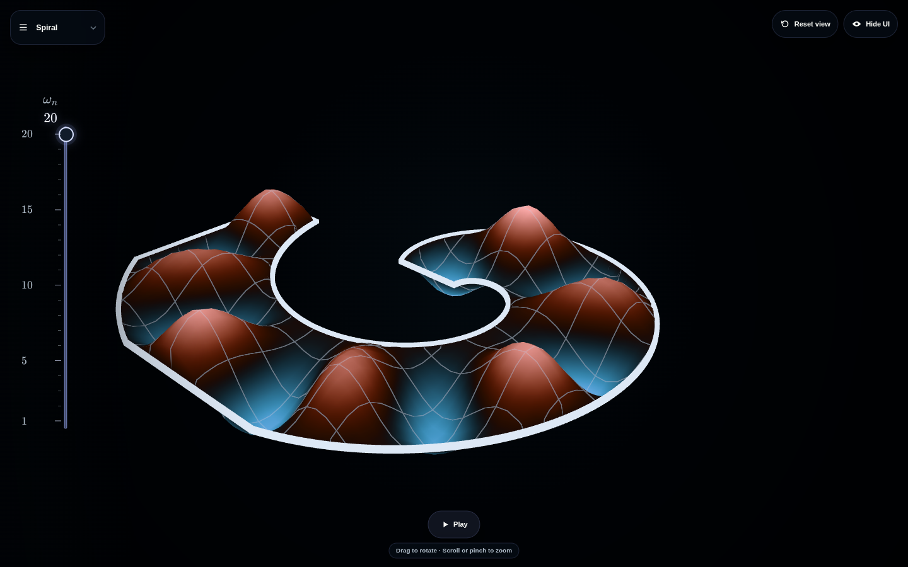

# Oscillating Membranes

[Open the interactive explorer](https://rayleighlord.github.io/OscillatingMembranes/)

Explore numerically computed vibration modes of fixed-boundary membranes on predefined or hand-drawn shapes.

